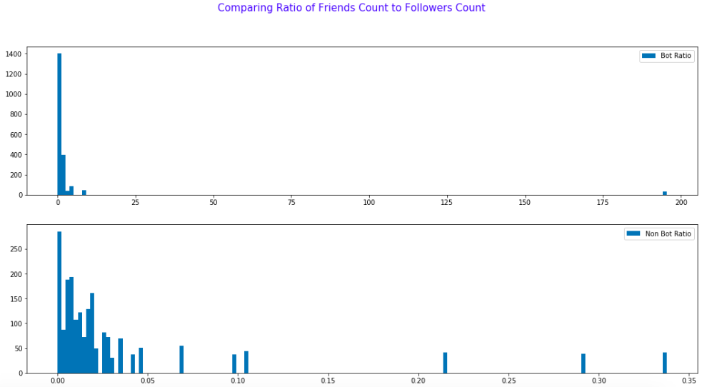
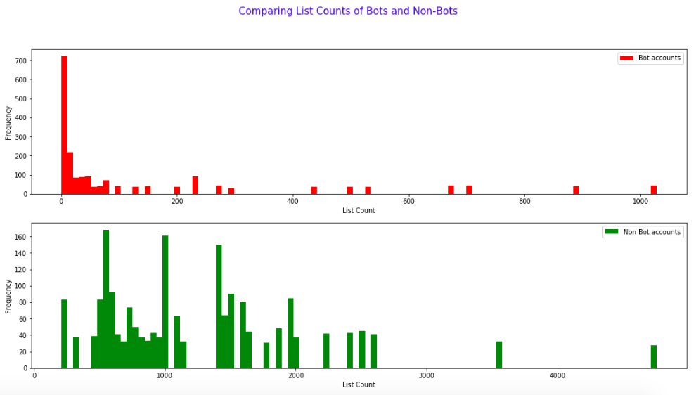
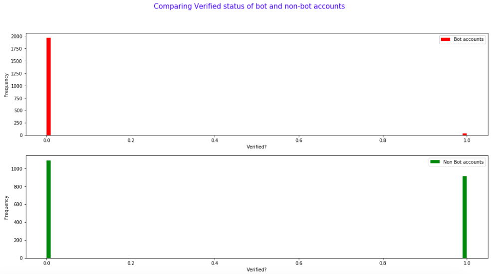

### CSCI S-109a - Introduction To Data Science - Final Project
### Contributors: [Karan Bhandarkar](mailto:karanbhandarkar@gmail.com), [Vivek Mishra](mailto:iblpvivek@icloud.com)

  
### [Welcome](README.md)&emsp;|&emsp;[**_Introduction and EDA_**](intro-and-eda.md)&emsp;|&ensp;[Literature Review](lit-review.md)&emsp;|&emsp;[Models](models.md)&emsp;|&emsp;[Results and Conclusion](results-and-concl.md)

## Content:
1. [Data Resources](#data-resources)
2. [EDA](#eda)
3. [Key Features](#key-features)

  
### Data Resources

We will collect our own data for this project. We were provided a basic Python script, tweepy_script.ipynb, that utilizes the tweepy library to access the Twitter API. We have significantly modified this script to fetch user details and user tweets. This process is detailed in the TwitterDataPreProcessing.ipynb submitted.

We have taken 50 accounts that tweet financial information and 50 bot accounts from different categories(to understand bot behavior). Getting hold of more accounts is difficult, especially bot accounts since Twitter has been clamping down, so we have bootstrapped to increase the user details dataset(shown in TwitterDataEDA.ipynb). 

Tweet details contain many details, most of which can be eyeballed and considered trivial. We have cleaned up these column to focus our EDA on specific columns (shown in TwitterDataEDA.ipynb). 

[Back to top](#content)

### EDA

#### 1. Ratio of Friends Count to Followers Count

In the real world, it is common to follow a lot more accounts than the number that follow you. People follow celebrity accounts, public figure accounts, company accounts and a lot more. Bots however, show a distict behaviour. They either are followed by close to none, or follow close to no accounts.

#### 2. List Counts of Bots and Non-Bots

This is obviously another indicator of popularity – the more lists you are on, the more popular you probably are. There is a clear distinction in the disctribution of this feature between bots and non-bots. Non-bots seem to have a kind of uniform distribution with tapering frequency at hight counts. The distribution of bots seems to be concentrated at the lower end of the counts spectrum.

#### 3. Verified Status of Bots and Non-Bots

As expected, non-bot accounts have examples of verified as well as not-verified accounts and bot accounts are always not-verified. Well, almost. Though, through further exploration, we noted that the small sample of 'verified' in the bots' histogram belongs to DFRLabs which has a bot twitter account but is a credible verified source.

A credible verified source bot, like possibly a newspaper's account, does not qualify as a bot for our intents and purposes. Thus, DFRLab and it's tweets were dropped from the datasets.

[Back to top](#content)

### Key Features

[Back to top](#content)
